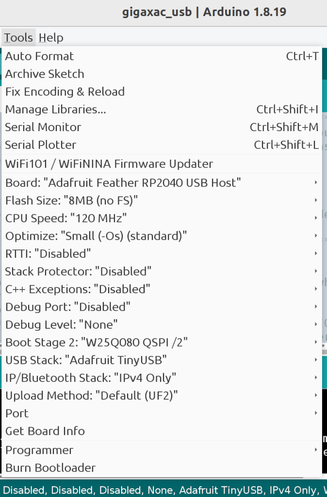

# gigaxac_usb -- SAC to XAC DIY Adapter

The Microsoft Xbox Adaptive Controller (XAC) for Xbox consoles and the Sony
Access Controller (SAC) for PlayStation 5 consoles work well for their
respective consoles. The SAC comes with a variety of different joystick toppers
and button shapes but has only four input jacks for external buttons and
joysticks. The XAC includes 19 input jacks for external buttons and joysticks
but has only two big buttons, a direction pad, and no joysticks.

Since the XAC does not include any joysticks, the SAC seems like a good add-on
for the XAC. Unfortunately, the SAC does not work because the XAC accepts a
small set of USB controllers. If only there were a USB adapter that makes
the SAC work when plugged the XAC. This project, gigaxac_usb, creates that
giga XAC USB adapter.

The gigaxac controller (SAC + gigaxac_usb + XAC) can be used on Xbox consoles
and Windows. Using commercially available USB controller adapters (for example,
Mayflash and Brook Gaming) the gigaxac controller can be used on PlayStation 4,
PlayStation 5, and Nintendo Switch.

For a gigaxac deluxe controller, plug SAC + gigaxac_usb into both USB host
ports on the XAC. All three game controllers work for Player 1. A fourth
controller may be added using either by using assist/co-pilot features.

## Prepare the gigaxac_usb Adapter Hardware

* Adafruit Feather RP2040 with USB Type A Host
* Snap-on Enclosure for Adafruit Feather RP2040 USB Host

Put the RP2040 board in firmware update mode by pressing and holding the BOOT
button then pressing and releasing the RESET button. Then release the BOOT
button. A USB flash drive should appear named RPI-RP2.

Drag and drop the [gigaxac_usb UF2
file](https://github.com/controllercustom/gigaxac_usb/releases/download/r2024-12-15/gigaxac_usb.ino.adafruit_feather_usb_host.uf2)
on the RPI-RP2 drive.  After a few seconds, the drive disappears indicating the
update is done. The adapter is ready to use.

## Prepare the SAC

To configure the SAC, use a PlayStation 5 or [this web site](https://www.jfedor.org/ps-access/).

When shipped from the factory, most of the SAC buttons do not work so this is
required to use all buttons and input jacks.

## Prepare the XAC

Use the Xbox Accessories app to upgrade to the newest firmware. The app is
included in Xbox Consoles and can be installed on Windows from the
Microsoft Store with no charge.

Use the Xbox Accessories app to remap the buttons. The default profile is not
useful.

Powering the XAC using a 5V 2A wall adapter is required. The voltage must be 5V
but the current rating may be 2A or higher. The XAC only draws as much current
as it needs. The SAC can draw as much as 0.5 A that the XAC cannot supply
without the wall adapter.

## Other consoles

The XAC is well supported by commercial controller adapters from Mayflash
and Brook Gaming so gigaxac_usb can be used to bridge SAC on other consoles.

### PlayStation 4

The Mayflash Magic-S Pro is shown in the following diagrams but the Magic-S
Ultimate also works. The DS4 controller is connected to the Mayflash
adapter via Bluetooth so this controller can be used by a helper or a co-pilot.
The PS4 console does not have an assist or co-pilot feature but the Mayflash
adapter can perform that function.

All the game controllers are for Player 1.

The Mayflash adapter supports other Bluetooth controllers. For example, a
DualSense controller can be used instead of the DS4 controller.

#### SAC and DualShock 4 on PlayStation 4

#### SAC, XAC, and DualShock 4 on PlayStation 4

#### SAC x 2, XAC, and DualShock 4 on PlayStation 4

### PlayStation 5

The SAC and DualSense are designed for PS5 so both can be used at the same time
without adapters or XAC. Two SACs can be used also. But if the XAC must be
included, the Brook Gaming Wingman FGC 2 adapter is the only option at this
time. Sony may in the future ban the FGC 2 so let the buyer beware.

The FGC 2 controller adapter does not support Bluetooth. But the PS5 can use a
DualSense as the main controller and the FGC adapter as the assist controller.
All controllers work for Player 1.

#### SAC and XAC on PlayStation 5

#### SAC x 2 and XAC on PlayStation 5

### Nintendo Switch

The Mayflash Magic-NS adapters is shown in the following diagrams but other
adapters may work. The Joy-Con controllers are connected to the Mayflash
adapter via Bluetooth so this can be used by a helper or a co-pilot. The Switch
console does not have an assist or co-pilot feature but the Mayflash adapter
can perform that function. All the game controllers are for Player 1.

The Mayflash adapter supports may other using USB and Bluetooth controllers.
For example, a DualSense controller can be used instead of the Joy-Cons.

#### SAC on Nintendo Switch

#### SAC and Joy-Cons on Nintendo Switch

#### SAC, XAC, and Joy-Cons on Nintendo Switch

#### SAC x 2, XAC, and Joy-Cons on Nintendo Switch

## Building from source code

### Arduino IDE Setup

Adafruit provides a tutorial on installing the Arduino IDE for this board.

https://learn.adafruit.com/adafruit-feather-rp2040-with-usb-type-a-host/arduino-ide-setup

### Libraries

Install the following libraries using the IDE Library manager.

* "Adafruit TinyUSB Library" by Adafruit
* "Pico PIO USB" by sekigon-gonnoc

Install the following libraries from github.com by downloading zip files
then installing them using the IDE Library manager "Install .ZIP library" option.

* https://github.com/touchgadget/switch_tinyusb

### Build Options

The following are the options that must be changed.

* Set "Board" to "Adafruit Feather RP2040 USB Host"
* Set "CPU Speed" to 120 MHz.
* Set "USB Stack" to "Adafruit TinyUSB".

